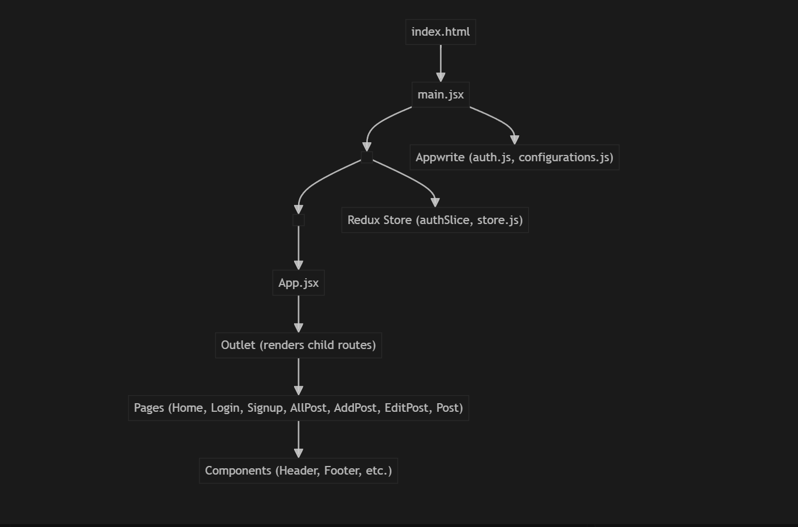

# Write Wave

Write Wave is a modern, full-stack blog application built with **React**, **Redux**, **Tailwind CSS**, and **Appwrite** as a backend-as-a-service (BaaS).
It features a beautiful, responsive UI, user authentication, and full CRUD for blog posts.

---

## ✨ Features

- User authentication (sign up, login, logout) via Appwrite
- Create, edit, and delete blog posts
- Upload and display images for posts
- Responsive, modern UI with Tailwind CSS
- Protected routes for authenticated users
- Real-time updates (Appwrite-powered)
- Clean, accessible, and mobile-friendly design

---

## 🛠 Tech Stack

- **Frontend:** React, Redux, React Router, Tailwind CSS, React Hook Form
- **Backend (BaaS):** Appwrite (Database, Auth, Storage)
- **Other:** Vite, ESLint, TinyMCE (Rich Text Editor)

---

## 🗺️ Platform Flow



---

## 🚀 Getting Started

### 1. **Clone the Repository**
```bash
git clone https://github.com/your-username/12mega-blog-project.git
cd 12mega-blog-project
```

### 2. **Install Dependencies**
```bash
npm install
```

### 3. **Configure Appwrite**
Create a `.env` file in the root of your project and add the following variables (get these from your Appwrite console):

```env
VITE_APPWRITE_URL=https://<YOUR_APPWRITE_ENDPOINT>
VITE_APPWRITE_PROJECT_ID=<YOUR_PROJECT_ID>
VITE_APPWRITE_DATABASE_ID=<YOUR_DATABASE_ID>
VITE_APPWRITE_COLLECTION_ID=<YOUR_COLLECTION_ID>
VITE_APPWRITE_BUCKET_ID=<YOUR_BUCKET_ID>
```

- Make sure your Appwrite instance allows CORS from `localhost:5173` (or your dev server port).

### 4. **Run the App**
```bash
npm run dev
```
Visit [http://localhost:5173](http://localhost:5173) in your browser.

---

## 🖼️ Branding & Assets

- The app uses a logo image from `src/assets/logo.jpg`.
  Replace this file with your own logo for custom branding.
- Favicon is set in `index.html` (default: `/vite.svg`).

---

## 📁 Project Structure

```
src/
  appwrite/         # Appwrite service logic (auth, database, storage)
  assets/           # Images and static assets (logo, etc.)
  components/       # Reusable UI components (Header, Footer, Button, etc.)
  pages/            # Route-based pages (Home, Login, Signup, Posts, etc.)
  store/            # Redux store and slices
  config/           # Appwrite config
  main.jsx          # App entry point
  App.jsx           # Main app layout
```

---

## 📝 Scripts

- `npm run dev` — Start development server
- `npm run build` — Build for production
- `npm run preview` — Preview production build
- `npm run lint` — Lint code with ESLint

---

## 🧑‍💻 Appwrite Setup

- [Appwrite Documentation](https://appwrite.io/docs)
- Create a **Project**, **Database**, **Collection** (for posts), and **Bucket** (for images).
- Set up authentication (email/password).
- Update your `.env` with the correct IDs.

---

## 🛡️ Security & Best Practices

- Authenticated routes are protected in the frontend.
- Users must log out before signing up or logging in with another account (Appwrite restriction).
- All sensitive keys are stored in environment variables.

---

## 📣 Status

This project is under active development.
Contributions, issues, and suggestions are welcome!

---

## 📄 License

MIT

---

**Happy blogging! 🚀**

